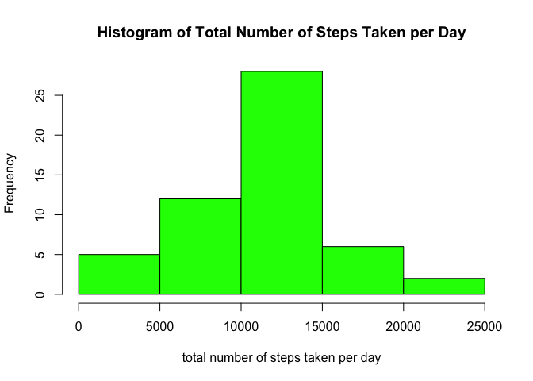
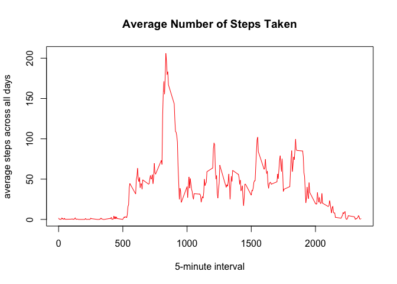
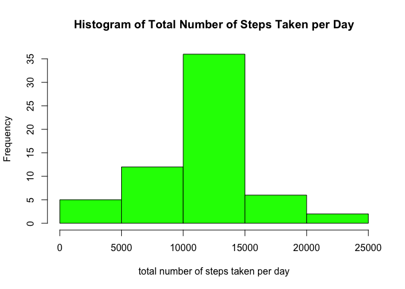
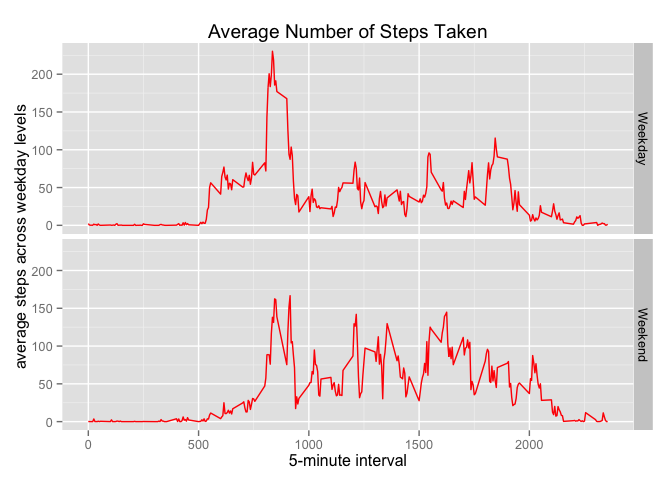

# Reproducible Research: Peer Assessment 1

## Loading and preprocessing the data

**1. Load the data**

```r
data <- read.csv("../activity.csv")
head(data)
```

```
##   steps       date interval
## 1    NA 2012-10-01        0
## 2    NA 2012-10-01        5
## 3    NA 2012-10-01       10
## 4    NA 2012-10-01       15
## 5    NA 2012-10-01       20
## 6    NA 2012-10-01       25
```

**2. Process/transform the data (if necessary) into a format suitable for your analysis**

```r
data$date <- as.Date(data$date, "%Y-%m-%d")
```

## What is mean total number of steps taken per day?

**1. Calculate the total number of steps taken per day**

```r
library(dplyr, warn.conflicts = FALSE)
dataByDate <- data %>% group_by(date) %>% summarise(sum(steps, na.rm = TRUE))
```

**2. Make a histogram of the total number of steps taken each day**

```r
colnames(dataByDate) = c("Date", "Sum")
dataByDate.f <- filter(dataByDate, Sum != 0)
hist(dataByDate.f$Sum, main = "Histogram of Total Number of Steps Taken per Day", xlab = "total number of steps taken per day", col = "green")
```

 

**3. Calculate and report the mean and median of the total number of steps taken per day**

```r
round(mean(dataByDate.f$Sum))
```

```
## [1] 10766
```

```r
round(median(dataByDate.f$Sum))
```

```
## [1] 10765
```
The mean is ```10766```, and the median is ```10765```.

## What is the average daily activity pattern?

**1. Make a time series plot of the 5-minute interval (x-axis) and the average number of steps taken, averaged across all days (y-axis).**

```r
dataByInterval <- data %>% group_by(interval) %>% summarise(mean(steps, na.rm = TRUE))
colnames(dataByInterval) = c("Interval", "Mean")
plot(dataByInterval$Mean ~ dataByInterval$Interval, type = "l", main = "Average Number of Steps Taken", xlab = "5-minute interval", ylab = "average steps across all days", col = "red")
```

 

**2. Which 5-minute interval, on average across all the days in the dataset, contains the maximum number of steps?**

```r
filter(dataByInterval, Mean == max(dataByInterval$Mean))$Interval
```

```
## [1] 835
```
The 835th 5-minute interval contains the maximum number of steps.

## Imputing missing values

**1. Calculate and report the total number of missing values in the dataset.**

```r
sum(is.na(data$steps))
```

```
## [1] 2304
```
The total number of missing values in the dataset is ```2304```.

**2. Devise a strategy for filling in all of the missing values in the dataset. The strategy does not need to be sophisticated. For example, you could use the mean/median for that day, or the mean for that 5-minute interval, etc.**

This method fills in the NA values with the mean for the coresponding 5-minute interval.

```r
fillNA <- numeric()
for (i in 1:nrow(data)) {
        temp <- data[i, ]
        if (is.na(temp$steps)) {
                steps <- subset(dataByInterval, Interval == temp$interval)$Mean
        }
        else {
                steps <- temp$steps
        }
        fillNA <- c(fillNA, steps)
}
```

**3. Create a new dataset that is equal to the original dataset but with the missing data filled in.**

```r
newData <- data
newData$steps <- fillNA
head(newData)
```

```
##       steps       date interval
## 1 1.7169811 2012-10-01        0
## 2 0.3396226 2012-10-01        5
## 3 0.1320755 2012-10-01       10
## 4 0.1509434 2012-10-01       15
## 5 0.0754717 2012-10-01       20
## 6 2.0943396 2012-10-01       25
```

**4. Make a histogram of the total number of steps taken each day and Calculate and report the mean and median total number of steps taken per day. Do these values differ from the estimates from the first part of the assignment? What is the impact of imputing missing data on the estimates of the total daily number of steps?**

```r
newDataByDate <- newData %>% group_by(date) %>% summarise(sum(steps))
colnames(newDataByDate) = c("Date", "Sum")
hist(newDataByDate$Sum, main = "Histogram of Total Number of Steps Taken per Day", xlab = "total number of steps taken per day", col = "green")
```

 

```r
round(mean(newDataByDate$Sum))
```

```
## [1] 10766
```

```r
round(median(newDataByDate$Sum))
```

```
## [1] 10766
```
After filling in the missing values, the mean remains the same but the median is a little bit different, increased by 1 from ```10765``` to ```10766```.

## Are there differences in activity patterns between weekdays and weekends?

**1. Create a new factor variable in the dataset with two levels - "weekday" and "weekend" indicating whether a given date is a weekday or weekend day.**

```r
day <- weekdays(data$date)
level <- vector()
for (i in 1:nrow(newData)) {
        if (day[i] == "Saturday" | day[i] == "Sunday") {
                level[i] <- "Weekend"
        }
        else {
                level[i] <- "Weekday"
        }
}
newData <- mutate(newData, weekday.level = as.factor(level))
head(newData)
```

```
##       steps       date interval weekday.level
## 1 1.7169811 2012-10-01        0       Weekday
## 2 0.3396226 2012-10-01        5       Weekday
## 3 0.1320755 2012-10-01       10       Weekday
## 4 0.1509434 2012-10-01       15       Weekday
## 5 0.0754717 2012-10-01       20       Weekday
## 6 2.0943396 2012-10-01       25       Weekday
```

**2. Make a panel plot containing a time series plot of the 5-minute interval (x-axis) and the average number of steps taken, averaged across all weekday days or weekend days (y-axis).**

```r
newDataByDay <- newData %>% group_by(interval, weekday.level) %>% summarise(mean(steps))
colnames(newDataByDay) = c("interval", "weekday.level", "mean")
library(ggplot2)
ggplot(newDataByDay, aes(interval, mean, fill = weekday.level)) +
        geom_line(col = "red") +
        facet_grid(weekday.level~.) +
        labs(x = "5-minute interval", y = "average steps across weekday levels", title = "Average Number of Steps Taken")
```

 

From the plot above, we can see there is a slight difference in activity patterns between weekdays and weekends, but the trend is pretty much the same.
